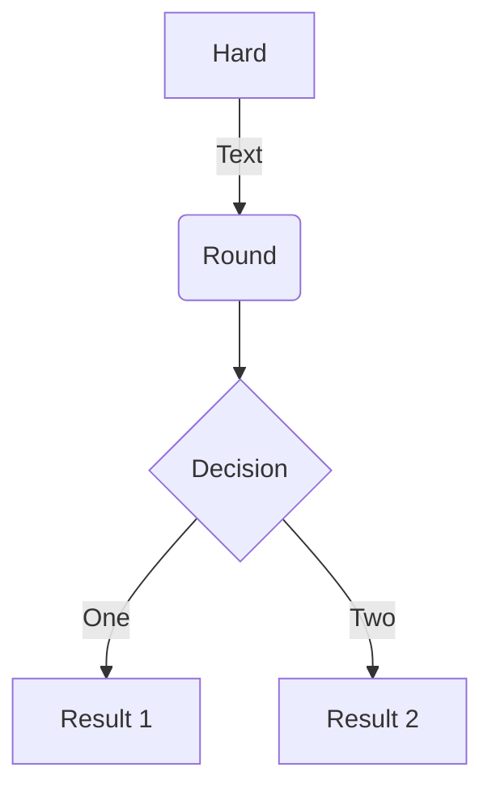
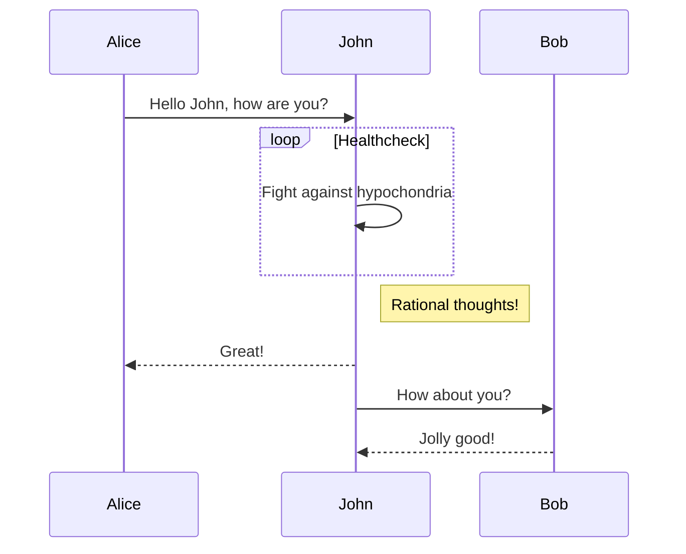
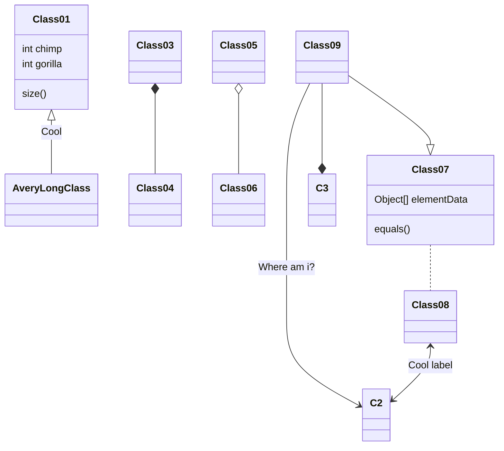
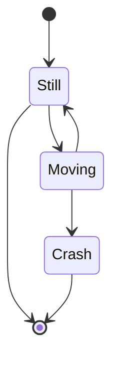

Scientific discovery often grows stronger through collaboration. During my Ph.D. research, I had the opportunity to work on several collaborative projects with scientists at the **Center for Functional Nanomaterials (CFN) at Brookhaven National Laboratory (BNL)** in New York, USA.

The CFN is a U.S. Department of Energy user facility that provides advanced characterization tools and scientific expertise for nanoscience research. Through this collaboration, I was able to investigate the structural and chemical properties of advanced nanomaterials using high-end facilities that are rarely available in standard laboratory environments.

These collaborative projects focused on understanding the **structure–function relationships of nitrogen-doped graphene and metal–organic framework (MOF) based nanomaterials**, particularly for electrochemical catalysis and thermal energy applications.

### The Value of National Laboratory Collaboration

Working with a national laboratory such as BNL offers a unique research environment. The collaboration allowed our research team to combine:

- Academic research at **NJIT’s Advanced Energy Systems and Microdevices Laboratory**

- Advanced characterization facilities at **CFN**

- Scientific discussions with experts specializing in nanomaterials and surface science

This environment enabled us to explore fundamental scientific questions about nanomaterials that would otherwise be difficult to investigate.

Beyond instrumentation, the collaboration fostered an atmosphere of **scientific exchange, mentorship, and interdisciplinary problem solving.**


### Research Themes of the Collaboration

My collaborative work at CFN mainly focused on **nitrogen-doped graphene (N-G) and metal–organic framework (MOF) based nanocatalysts.** These materials are promising candidates for energy technologies because of their tunable structure and catalytic activity.

The key research topics I worked on include the following.

### 1. Durability of N-G/MOF Catalysts for Oxygen Reduction Reaction

One of the major projects focused on evaluating the **durability of highly active MOF-modified nitrogen-doped graphene catalysts** for the **oxygen reduction reaction (ORR)**, a critical reaction in fuel cells and metal–air batteries.

This work aimed to understand how the catalyst structure evolves during long-term electrochemical operation and how structural degradation influences catalytic performance.


### 2. Evolution of Nitrogen Functional Groups in N-G/MOF Composites

Another key research question involved **quantifying the changes in nitrogen functional groups** when a metal–organic framework structure such as ZIF-8 is integrated with nitrogen-doped graphene.

Nitrogen functionalities—such as pyridinic, pyrrolic, and graphitic nitrogen—play a significant role in determining catalytic activity. Understanding how these groups evolve during material synthesis helps clarify the origin of catalytic performance.


### 3. Structural Evolution of Catalytic Active Sites

In addition to quantifying nitrogen groups, our work also investigated the **chemical structural evolution of catalytic active sites** formed during the integration of N-G and MOF materials.

By combining synthesis and advanced characterization, we examined how the interaction between graphene structures and MOF-derived components leads to the formation of new catalytic sites.

This insight is essential for designing more efficient **non-precious metal catalysts** for electrochemical energy systems.


### 4. Identification of Catalytic Sites in N-G/MOF Nanocatalysts

Another focus of the collaboration was to investigate the **nature and distribution of catalytic active sites** within N-G/MOF nanocatalysts.

Advanced characterization techniques helped us examine how different structural features—such as nitrogen configurations, carbon structure, and MOF-derived components—contribute to catalytic activity.

These studies contribute to the broader effort of replacing expensive platinum-based catalysts with **sustainable carbon-based alternatives.**


### 5. Nanomaterials for Enhancing Phase Change Materials (PCM)

Beyond electrocatalysis, our collaboration also explored the use of **nitrogen-doped carbon nanomaterials and MOFs as additives for phase change materials (PCMs).**

PCMs are widely used for **thermal energy storage and temperature regulation.** By integrating nanomaterials with PCMs, we investigated ways to enhance properties such as:

- Thermal conductivity

- Energy storage efficiency

- Material stability

This work connects nanomaterial science with **thermal energy management technologies.**


### Learning from the CFN Research Environment

Working with scientists at CFN provided valuable exposure to advanced research practices. The experience allowed me to:

-- Conduct experiments using state-of-the-art characterization tools

-- Collaborate with experts in nanomaterials and surface chemistry

-- Interpret complex structural and spectroscopic data

-- Connect fundamental material properties with device-level performance

These collaborations also strengthened the scientific foundation of several publications and ongoing research projects.

### Personal Reflection

My experience collaborating with Brookhaven National Laboratory has been one of the most rewarding aspects of my doctoral research journey. The collaboration not only expanded the scope of our research but also provided valuable insights into how large-scale research facilities operate.

Working alongside scientists from different disciplines and institutions reinforced an important lesson in research: **breakthrough discoveries often emerge from collaborative efforts that combine diverse expertise and resources.**


### My Thoughts on these BNL Collaborative Works

Collaborative research at national laboratories plays a crucial role in advancing modern science. My work with the **Center for Functional Nanomaterials at Brookhaven National Laboratory** allowed me to explore the complex chemistry and structure of advanced nanomaterials while contributing to the development of technologies for **energy conversion and thermal energy storage.**

These experiences continue to shape my approach to research, emphasizing both **fundamental understanding and practical application of advanced materials.**


<!--
## Embed Rich Content

HuggingFace Model



HuggingFace Dataset



GitHub Repository



Custom embed with manual data



<!--

### Custom Images

Embed beautiful images from any source with Hugo image processing (Unsplash, custom URLs, etc.):



You can also add images to any platform embed:



## Charts

Hugo Blox supports the popular [Plotly](https://plot.ly/) format for interactive data visualizations. With Plotly, you can design almost any kind of visualization you can imagine!

Save your Plotly JSON in your page folder, for example `line-chart.json`, and then add the `` shortcode where you would like the chart to appear.

Demo:



You might also find the [Plotly JSON Editor](http://plotly-json-editor.getforge.io/) useful.

## Diagrams

Hugo Blox supports the _Mermaid_ Markdown extension for diagrams.

An example **flowchart**:

    ```mermaid
    graph TD
    A[Hard] -->|Text| B(Round)
    B --> C{Decision}
    C -->|One| D[Result 1]
    C -->|Two| E[Result 2]
    ```

renders as



An example **sequence diagram**:

    ```mermaid
    sequenceDiagram
    Alice->>John: Hello John, how are you?
    loop Healthcheck
        John->>John: Fight against hypochondria
    end
    Note right of John: Rational thoughts!
    John-->>Alice: Great!
    John->>Bob: How about you?
    Bob-->>John: Jolly good!
    ```

renders as



An example **class diagram**:

    ```mermaid
    classDiagram
    Class01 <|-- AveryLongClass : Cool
    Class03 *-- Class04
    Class05 o-- Class06
    Class07 .. Class08
    Class09 --> C2 : Where am i?
    Class09 --* C3
    Class09 --|> Class07
    Class07 : equals()
    Class07 : Object[] elementData
    Class01 : size()
    Class01 : int chimp
    Class01 : int gorilla
    Class08 <--> C2: Cool label
    ```

renders as



An example **state diagram**:

    ```mermaid
    stateDiagram
    [*] --> Still
    Still --> [*]
    Still --> Moving
    Moving --> Still
    Moving --> Crash
    Crash --> [*]
    ```

renders as


-->


<!--
## Data Frames

Save your spreadsheet as a CSV file in your page's folder and then render it by adding the _Table_ shortcode to your page:

```go

```

renders as


-->

<!--
## Interactive Buttons

Add engaging call-to-action buttons to your data visualization posts:

### Basic Buttons

Contact Us

&nbsp;

Learn Plotly

```go-html-template
Contact Us

Learn Plotly
```

### Styled Buttons for Data Actions

View Dashboard

&nbsp;

Download Data

&nbsp;

View Source Code

```go-html-template
View Dashboard

Download Data

View Source Code
```
-->

<!--
### Multiple Aligned Buttons

Try Jupyter

&nbsp;

Open in Colab

```go-html-template
Try Jupyter

Open in Colab
```

## Did you find this page helpful? Consider sharing it 🙌
-->

-->
